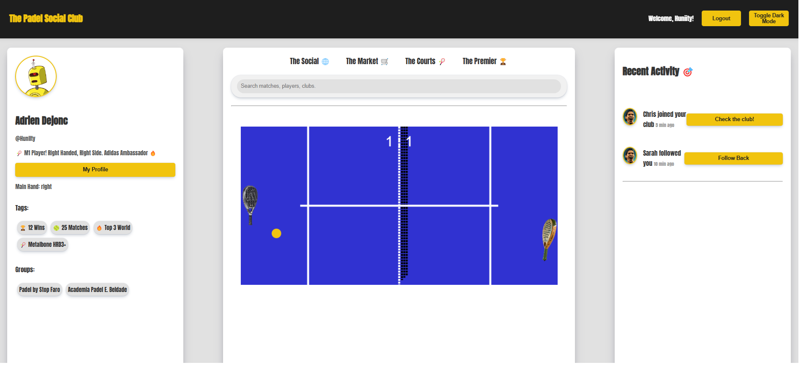

### **Titulo do website:** The Padel Social Club

 

### **Descrição do website:** A Padel Social Network where users can share about their journey

 

 

# Requisitos

1. ✅ Converter objecto javascript para json e vice versa - [Reference](https://docs.google.com/presentation/d/16kchou9WWyFQUxsQ6YmfFqjlAc1HmMlo/edit?slide=id.g347fc7997ef_0_53#slide=id.g347fc7997ef_0_53) \
    `Exo1.js` \
    [here](./exo/exo1.js) - exo1.js

2. ✅ Guardar e ler informação da local storage - [Reference](https://docs.google.com/presentation/d/16kchou9WWyFQUxsQ6YmfFqjlAc1HmMlo/edit?slide=id.g3483b2c8586_0_105#slide=id.g3483b2c8586_0_105) \
    `exo2.js` \
    [here](./exo/exo2.js) - exo2.js

3. ✅ Inserir informação através de formulário e mostrar informação após submeter [Reference](https://docs.google.com/presentation/d/16kchou9WWyFQUxsQ6YmfFqjlAc1HmMlo/edit?slide=id.g34944a9bf2f_0_68#slide=id.g34944a9bf2f_0_68) \
    `exo3.js` \
    [here](./exo/exo3.js) - exo3.js

4. ✅ Fazer fetch de uma api e mostrar resultados no ecrã [Reference](https://docs.google.com/presentation/d/16kchou9WWyFQUxsQ6YmfFqjlAc1HmMlo/edit?slide=id.g349a8828690_2_63#slide=id.g349a8828690_2_63) \
    `exo4.js` \
    [here](./exo/exo4.js) - exo4.js
5. ✅ Através de um input, inserir um termo de procura e apresentar resultados de uma API pública [Reference](https://docs.google.com/presentation/d/16kchou9WWyFQUxsQ6YmfFqjlAc1HmMlo/edit?slide=id.g304d5c085db_0_70#slide=id.g304d5c085db_0_70) \
    `padel_module.js + padel_api.js` \
    [here](./lib/padel_api.js) - padel_api.js \
    [here](./scripts/padel_module.js) - padel_module.js
6. ✅ Implementar pelo menos 2 apis nativas de javascript, por exemplo geolocation e clipboard [Reference](https://docs.google.com/presentation/d/16kchou9WWyFQUxsQ6YmfFqjlAc1HmMlo/edit?slide=id.g304d5c085db_0_142#slide=id.g304d5c085db_0_142) \
    `exo6.js` \
    [here](./exo/exo6.js) - exo6.js
7. ✅ Desenhar 2 formas básicas no canvas api [Reference](https://docs.google.com/presentation/d/16kchou9WWyFQUxsQ6YmfFqjlAc1HmMlo/edit?slide=id.g34e23982766_0_58#slide=id.g34e23982766_0_58) \
    `courts.js` \
    [here](./scripts/courts.js) - courts.js
8. ✅ Implementar um component de web components [Reference](https://docs.google.com/presentation/d/16kchou9WWyFQUxsQ6YmfFqjlAc1HmMlo/edit?slide=id.g34e23982766_0_129#slide=id.g34e23982766_0_129) \
    `shared_components.js` \
    [here](./scripts/shared_components.js.js) - shared_components.js.js
9. ✅ Utilizar uma biblioteca externa, por exemplo, caroussel [Reference](https://docs.google.com/presentation/d/16kchou9WWyFQUxsQ6YmfFqjlAc1HmMlo/edit?slide=id.g34ff373a90f_0_47#slide=id.g34ff373a90f_0_47) \
    `exo9.js + exo9_toast.js` \
    [here](./exo/exo9.js) - exo9.js \
    [here](./exo/exo9_toast.js) - exo9_toast.js
10. ✅ Gerar report do Lighthouse e colocar screenshot no repositório do projeto. Ter pelo menos 90 de score em 2 das 4 métricas [Reference](https://docs.google.com/presentation/d/16kchou9WWyFQUxsQ6YmfFqjlAc1HmMlo/edit?slide=id.g304f4088e01_1_85#slide=id.g304f4088e01_1_85) \
    `In the repo - PC Report` \
    [here](./lighthouse_pc_padel.pdf) - lighthouse_pc_padel.pdf

11. ✅ Pelo menos 1 exemplo de cada CRUD operation
    `posts_module.js` \
    [here](./scripts/posts_module.js) - posts_module.js

## Bonus

Implementação dos requisitos ao contexto do projeto em si ✅ \
    `Check Above Requirements` 

Apresentar projeto no portfolio desenvolvido em Web Pages ✅ \
    `In Navigator Check` \
    [here](https://huniity.github.io/frontend1-aulas/homepage.html) - GitHub WebPage Portfolio